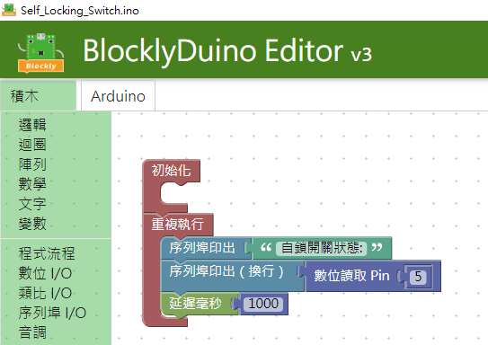
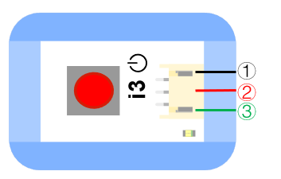

# i3自鎖開關

## 實體照片


## 基本信息

中文名稱：自鎖開關

英文名稱：Self Locking Switch

序號：i3

SKU：BOS0003

## 功能簡介

自鎖開關是一種常見的按鈕開關。與按鈕模組不同的地方在於它可以把開關鎖定在某個狀態。直到第二次被按以後彈起。這種巧妙的技術廣泛應用於我們的家用電器中，比如電鍋、電熱水壺等。


## 使用說明

自鎖開關能夠識別按鍵動作並輸出數位訊號。其機制如下：

> * 第一次按鍵，按鍵按下，開關接通並保持，模組持續輸出高電位，即「開」或「1」；
> * 第二次按鍵，按鍵彈起，開關斷開，模組輸出低電位，即「關」或「0」。

以自鎖開關控制LED燈為例，第一次按下按鍵，持續輸出高電位，小燈恆亮；第二次按下按鍵，按鍵被彈起，輸出低電位，小燈熄滅。

\*\*\*\*


## 原理介紹

無

## 實作範例教學-基本篇

### 點亮LED燈（非程式設計）

**範例說明：**通過自鎖開關控制LED燈的亮滅。第一次按下自鎖開關，LED燈被點亮，第二次按下自鎖開關，LED燈被熄滅。

**元件清單：**自鎖開關；LED燈模組；主控板：1組輸入/輸出端。

**連線圖：**


### 開啟風扇

**範例說明：**通過自鎖開關控制風扇的開啟與關閉。第一次按下自鎖開關，風扇開始轉動，第二次按下自鎖開關，風扇停止轉動。

**元件清單：**自鎖開關；風扇模組；主控板：1組輸入/輸出端。

**連線圖：**


### 毛毛蟲

**範例說明：**通過自鎖開關和伺服機模組控制馬達模組像毛毛蟲一樣向前爬動。

**元件清單：**自鎖開關；伺服機模組；馬達模組；主控板：1組輸入/輸出端。

**連線圖：**


## 實作範例教學-Micro:bit篇

### 點亮LED燈（程式設計）

**範例說明：**通過自鎖開關控制LED燈的亮滅。第一次按下自鎖開關，LED燈被點亮，第二次按下自鎖開關，LED燈被熄滅。

**元件清單：**自鎖開關；LED燈模組；Micro:bit；Micro:bit BOSON擴充板。

**連線圖：**將自鎖開關連接至Micro:bit擴充板P0腳位，LED燈模組連接至Micro:bit擴充板P8腳位。


**執行流程：**① 如果P0腳位輸出高電位「1」，即自鎖開關被按下，則LED燈模組亮起；② 如果P0腳位輸出低電位「0」，即自鎖開關被鬆開，則LED燈模組熄滅。

**程式示意圖（中文版）：**


**Example program\(English\):**


## 實作範例教學-**LinkIt 7697**篇

**範例說明：**使用「LinkIt 7697 開發板」讀取「自鎖開關」，自鎖開關是一種常見的按鈕開關。與按鈕模組不同的地方在於它可以把開關鎖定在某個狀態，直到第二次被按以後彈起。自鎖開關按下或放開的狀態（需搭配 LinkIt 7697 NANO 擴充板）。

**連線圖：**自鎖開關是數位訊號輸入， 可以接「D0 ~ D13」的 LinkIt 7697 NANO Breakout訊號端上。 本範例連接到「D5」。





產生出的Arduino程式如下：

```text
void setup()
{
   Serial.begin(9600);
   pinMode(5, INPUT);
}

void loop()
{
   Serial.print("自鎖開關狀態:");
   Serial.println(digitalRead(5));
   delay(1000);
}
```

## 商品規格

腳位說明：



| **編號** | **名稱** | **功能說明** |
| :---: | :---: | :---: |
| 1 | GND | 電源接地 |
| 2 | VCC | 電源正極 |
| 3 | D | 數位訊號 |

重量：（g）

尺寸：26mm\*22mm

工作電壓：3.0-5.5V

工作電流：不大於5mA@5V

