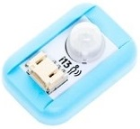
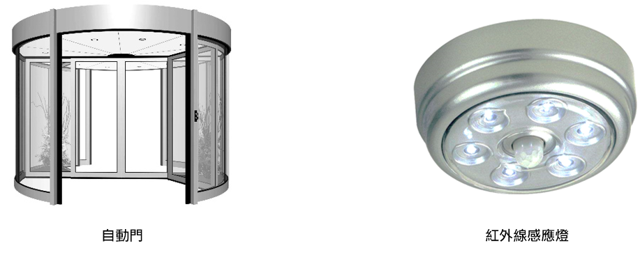
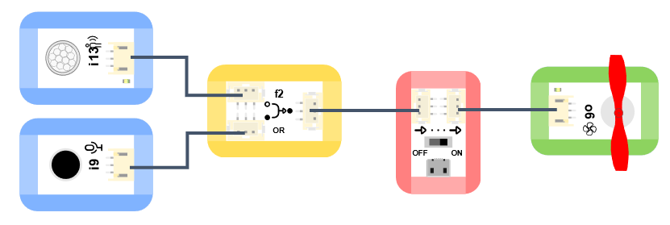
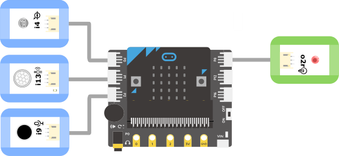

# i13動作感測器

## 實體照片



## 基本信息

中文名稱：動作感測器

英文名稱：Motion Sensor

序號：i13

SKU：BOS0013

## 功能簡介

動作感測器可以檢測到做動作的人或動物身上發出的紅外線，可以應用於各種需要檢測動作的場合，如樓梯，走道，洗手間，電梯等公共生活場所；還可以用於軍事行動，在林地戰中探測密林中的敵人等。



## 使用說明

動作感測器可感受到7米以內物體的運動，感應角度為100°，當有行動的人經過動作感測器的探測區域時，動作感測器就會輸出高電位。但需要注意的是高電位輸出會有一定的時間延遲，通常為2.3~3秒左右。按照下圖所示連接電路，通電後即可通過動作感測器控制LED燈的亮滅：當有人經過時點亮LED燈，否則熄滅LED燈。


## 原理介紹

人體都有恆定的體溫，一般在37度，所以會發出特定波長10UM左右的紅外線，動作感測器內置的紅外線鏡頭剛好可以探測到人體發射的10UM左右的紅外線。人體發射的10UM左右的紅外線通過菲涅爾透鏡增強後聚集到紅外感應源上，紅外感應源通常採用熱釋電元件，這種元件在接收到人體紅外輻射溫度發生變化時就會失去電荷平衡，向外釋放電荷，產生電號。 來源：[https://baike.baidu.com/item/热释电红外线传感器/578786](https://baike.baidu.com/item/热释电红外线传感器/578786)

## 實作範例教學-基本篇

### 感應發光小屋

**範例說明：**製作一個感應發光小屋，當有人經過時，動作感測器檢測到人，LED燈亮起。

**元件清單：**動作感測器；主控板：1組輸入/輸出端；計時模組（0-6秒）；LED燈模組。

**連線圖：**


### 節能風扇

**範例說明：**利用聲音感測器與動作感測器作為雙重開關，控制風扇的啟動與停止。有人時，風扇啟動，無人時，風扇停止，達到節約能源的目的。

**元件清單：**動作感測器；聲音感測器；運算邏輯模組 OR；主控板：1組輸入/輸出端；風扇模組。

**連線圖：**



### 教師節的禮物

**範例說明：**提前錄製10秒鐘的教師節祝福語，當老師走進教室時，動作感測器感受到老師，LED燈亮起，光感測器感受到光，控制揚聲器播放祝福語。

**元件清單：**LED燈模組；動作感測器；光感測器；主控板：3組輸入/輸出端；錄音機模組/喇叭。

**連線圖：**


## 實作範例教學-Micro:bit篇

### 智慧路燈

**範例說明：**製作一個智慧路燈，當夜間有人經過或有聲音時路燈自動點亮並持續10秒。

**元件清單：**動作感測器；聲音感測器；光感測器；LED燈模組；Micro:bit；Micro:bit BOSON擴充板。

**連線圖：**



**設計意圖：**智慧路燈被點亮需要同時滿足兩個條件，即①夜間；②有人經過或有聲音。為了區分白天黑夜，可以使用光感測器感知光的強度（這裡設定臨界值為100，當光感測器輸出類比值小於50時判定當前處於夜晚）；為了判斷是否有人經過，可以使用動作感測器，輸出高電位表示有人經過，輸出低電位即無人經過；為了是否有聲音，可以使用聲音感測器感知聲音大小（這裡設定臨界值為50，當聲音感測器輸出類比值大於50時判定為有聲音）。最後，結合光感測器、動作感測器、聲音感測器的輸出訊號進行邏輯判斷，若滿足點亮路燈的2個條件就給LED燈模組輸入高電位並持續十秒，否則熄燈LED燈。

**\*注意：**本程式中光感測器和聲音感測器的臨界值需要根據具體環境因素進行調整。\*

**執行流程：**

① 夜間有人經過、夜間有聲音：當光感測器輸出類比值小於100且動作感測器感知到有人經過或聲音感測器檢測到聲音（輸出類比值大於50），點亮LED燈持續10秒；

② 白天、夜間無人經過、夜間沒有聲音：當光感測器輸出類比值大於等於100，或光感測器輸出類比值小於100但動作感測器未感知到有人經過且聲音感測器未檢測到聲音（輸出類比值小於50），熄滅LED燈。

**程式示意圖（中文版）：**


**Example program\(English\)：**


## 實作範例教學-LinkIt 7697篇

**範例說明：**使用「LinkIt 7697 NANO Breakout」連接「Motion Sensor 動作感測器」, 每1秒讀取動作感測器數值。此Motion Sensor 動作感測器包含於「Starter Kit for micro:bit」內。

**元件清單：**自鎖開關；LinkIt 7697；LinkIt 7697 NANO 擴充板。

**連線圖：**動作感測器是數位訊號輸入， 可以接「D0 ~ D13」的 LinkIt 7697 NANO Breakout訊號端上。 本範例連接到「D5」

**程式說明：**每1秒鐘會讀取動作感測器狀態一次， 並可透過序列埠監控視窗看到動作感測器狀態 。

產生出的Arduino程式如下：

```text
void setup()
{

  pinMode(5, INPUT);
  Serial.begin(9600);

}


void loop()
{
  Serial.println(digitalRead(5));
  delay(1000);
}
```

## 商品規格

腳位說明：


| **編號** | **名稱** | **功能說明** |
| :---: | :---: | :---: |
| 1 | GND | 電源接地 |
| 2 | VCC | 電源正極 |
| 3 | D | 數位訊號 |
| 4 | LED燈 | 動作指示 |

重量： （g）

尺寸：26mm\*22mm

工作電壓：3.0-5.0V

