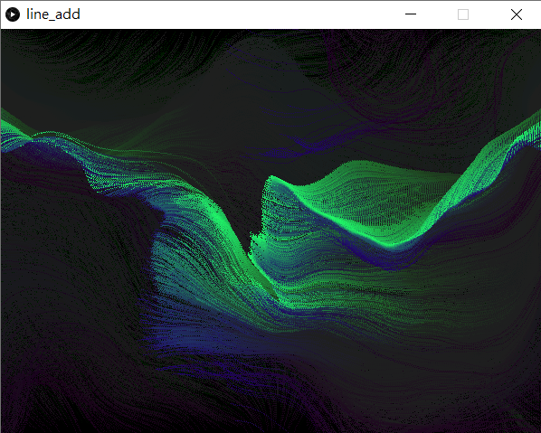
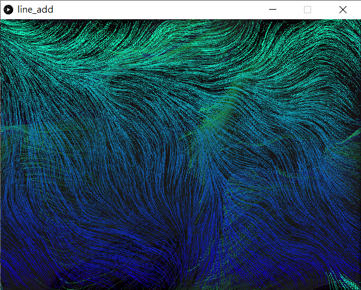
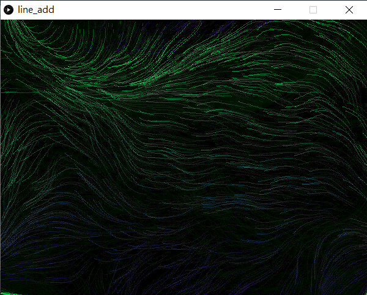
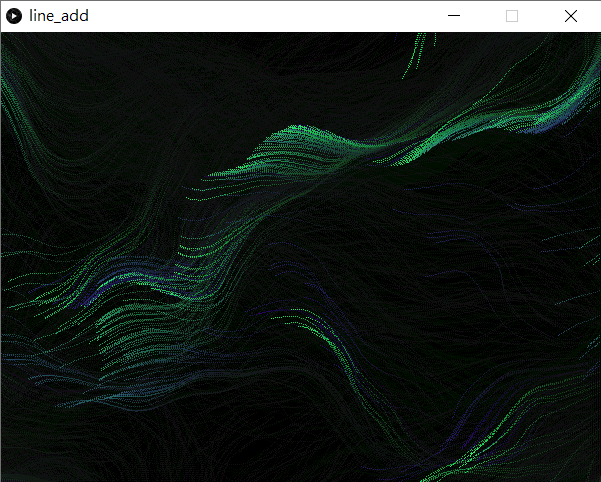
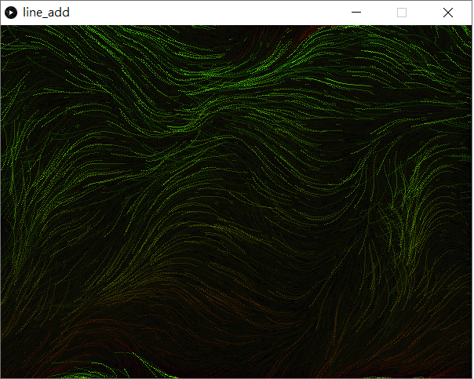

# 範例04\_療癒海浪 - 按鈕與光感測器

## 【教學】Arduino首次接觸就上手\_ep4 Processing讀取按鈕與光感測器

本篇與先前的做法不同，不再使用 Standard Firmata 來直接與 Ardiuno 溝通。而是讓 Arduino 透過 ` Serial.write()` 語法逐個發送資料。這樣的作法雖然較為複雜，但允許使用者加入更多自定義的效果，Arduino也不再受限於基礎的 `arduino.digitalWrite()` 與 `arduino.analogWrite()` 語法，而是透過 `line.read()` 語法逐一讀入訊息之後進行相關操作。兩種作法都很不錯，都試試看吧！

## Arduino 端程式碼 - 自定義發送資料

請開啟 Arduino IDE (自行下載或使用 HangeekDuino 下的 Arduino 1.8.5)，新增一個專案並填入以下內容或直接使用範例。請注意我們是使用 Arduino首次接觸就上手套件，所以以下的腳位編號是固定的，您可以自行加入其他感測器或調整其數學關係來做到不同效果：

* int r = analogRead(A2);     //使用聲音感測器來控制紅色濃度
* int alpha = analogRead(A2); //使用聲音感測器來控制透明度
* int button = digitalRead(6);//使用按鈕來改變 particle 效果 
* int b = analogRead(A6);     //使用光感測器來控制藍色濃度
* int f = analogRead(A0);     //使用旋轉電位計來控制 frame rate 速度
* Serial.write();             //發送資料給 Processing


檔名 - [line\_add.ino](https://github.com/cavedunissin/boson/tree/master/processing_arduino/example/wave)

```text
void setup() {
  Serial.begin(9600);
  pinMode(6, INPUT);
}

void loop() {
  int r = analogRead(A2);     //Sound sensor
  int alpha = analogRead(A2); 
  int button = digitalRead(6);
  int b = analogRead(A6);     //light sensor
  int f = analogRead(A0);     //rotatry potentiometer
  Serial.write(r / 4);        //send out all data to processing
  Serial.write(alpha / 4);
  Serial.write(button);
  Serial.write(b / 4);
  Serial.write(r / 8);
  delay(100);
}
```

## Processing 程式範例 - 接收 Arduino 發送的訊號來變換效果

新增一個 Processing 專案，並輸入以下程式碼，請確認 Arduino 首次接觸就上手套件已正確燒錄以上 .ino 檔。輸入完成直接執行以下 pde，會看到以下執行畫面，前三張為 particle 數量為6000時的執行畫面，後三張則是 600。執行過程中請分別操作各感測器看看效果如何吧！

檔名 - [line\_add.pde](https://github.com/cavedunissin/boson/tree/master/processing_arduino/example/wave)

執行畫面如下：

**Particle數量為6000時的三個執行畫面**  






**Particle數量為600時的三個執行畫面**  







```text
Particle[] particles;
float alpha;
import processing.serial.*;
import cc.arduino.*;
Arduino arduino;
Serial line;  
int R; //"R"GB
int value;
int button;
int B; //RG"B"
int F; //framRate

void setup() {
  size(1280, 200);

  line=new Serial(this, Arduino.list()[0], 9600);
  background(0);
  noStroke();
  setParticles();//set array
}

void draw() {
  //change color but right now
  if ( line.available() > 0) {
    R = line.read();
    value=line.read();
    button = line.read();
    B = line.read();
    F= line.read();
    if (button ==1) {
      setParticles();
    }
    println(R, "&", B, "&", button, "&", F, "&", value);
  }
  float FR = map(F, 0, 255, 25, 60);
  frameRate(FR);
  alpha = map(value, 0, width, 3, 35);
  fill(0, alpha);
  rect(0, 0, width, height);
  loadPixels();
  for (Particle p : particles) {
    p.move();
  }
  updatePixels();
}

void setParticles() {
  particles = new Particle[6000];
  for (int i = 0; i < 6000; i++) {  
    float x = random(width);
    float y = random(height);
    float adj = map(y, 0, height, 255, 0);
    int c = color(R, adj, B);
    particles[i]= new Particle(x, y, c);
  }
}

void mousePressed() {
  setParticles();
}

public class Particle {
  float posX, posY, incr, theta;
  color  c;
  Particle(float xIn, float yIn, color cIn) {
    posX = xIn;
    posY = yIn;
    c = cIn;
  }

  public void move() {
    update();
    wrap();
    display();
  }

  void update() {
    incr +=  .008;
    theta = noise(posX * .006, posY * .004, incr) * TWO_PI;
    println(round(theta));
    posX += 2 * cos(theta);
    posY += 2 * sin(theta);
  }

  void display() {
    if (posX > 0 && posX < width && posY > 0  && posY < height) {
      pixels[(int)posX + (int)posY * width] =  c;
    }
  }

  void wrap() {
    if (posX < 0) posX = width;
    if (posX > width ) posX =  0;
    if (posY < 0 ) posY = height;
    if (posY > height) posY =  0;
  }
}
```

