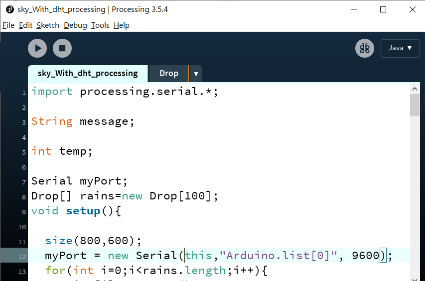
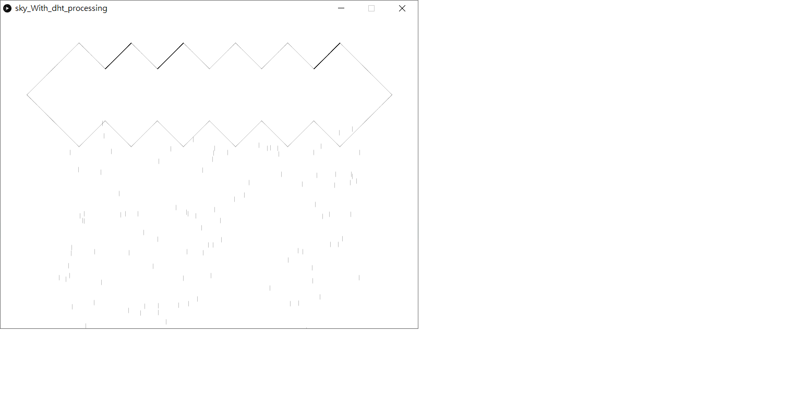
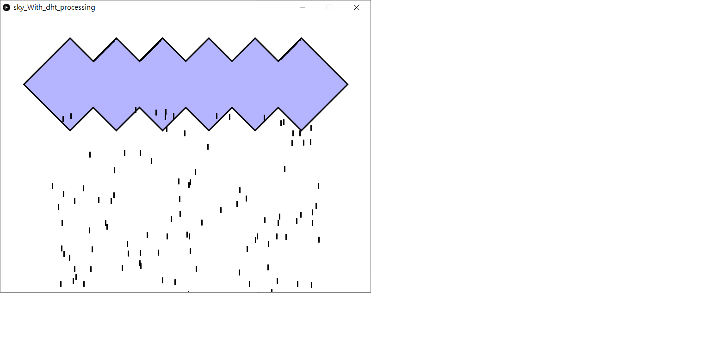
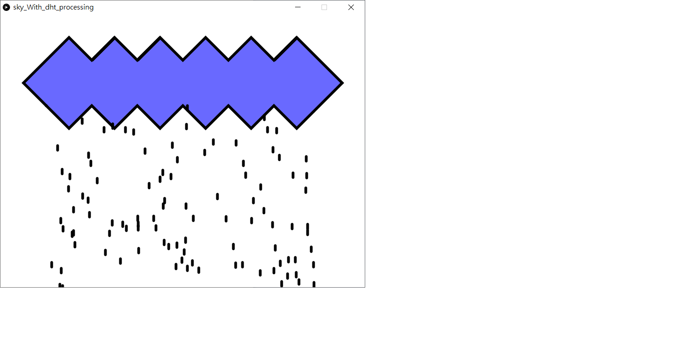

# 範例05\_天空飄著雲 - DHT溫溼度感測器

## 【教學】Arduino首次接觸就上手\_ep5 Processing 讀取溫溼度感測器

本篇與先前的做法不同，不再使用 Standard Firmata 來直接與 Ardiuno 溝通。而是讓 Arduino 透過 `Serial.write()` 語法逐個發送資料。這樣的作法雖然較為複雜，但允許使用者加入更多自定義的效果，Arduino也不再受限於基礎的 `arduino.digitalWrite()` 與 `arduino.analogWrite()` 語法，而是透過 `line.read()` 語法逐一讀入訊息之後進行相關操作。兩種作法都很不錯，都試試看吧！

## Arduino 端程式碼 - 自定義發送資料

請開啟 Arduino IDE \(自行下載或使用 HangeekDuino 下的 Arduino 1.8.5\)，新增一個專案並填入以下內容或直接使用範例。請注意我們是使用 Arduino首次接觸就上手套件，所以 DHT11 溫溼度感測器的腳位是固定在 D3。[DHT11感測器基本教學請點我](https://cavedu.gitbook.io/cavedu/hangeekduino/samplecode/input_module/dht11sensor)。

檔名 - [rain.ino](https://github.com/cavedunissin/boson/tree/master/processing_arduino/example/rain)

```text
#include "DHT.h"
#define DHTPIN 3
#define DHTTYPE DHT11
DHT dht(DHTPIN, DHTTYPE);

void setup()
{
  Serial.begin(9600);
  dht.begin(); 
}

void loop()
{
  delay(100);
  int h = dht.readHumidity();   //取得濕度
  int t = dht.readTemperature();  //取得溫度C
  Serial.write(h);
  Serial.write(t);  
} 
```

## Processing 程式範例 - 接收 Arduino 發送的溫溼度感測器資料來變換效果

新增一個 Processing 專案，並輸入以下程式碼，請注意 Drop.pde 中只有定義了 Drop 類別，需要與主程式在同一個資料夾中，如果檔案路徑有錯的話就無法執行，請務必注意喔。確認 Arduino 首次接觸就上手套件已正確燒錄以上 .ino 檔。輸入完成直接執行以下 pde，會看到以下執行畫面。用嘴巴對著DHT11感測器呵氣，就可以看到雲朵的藍色變深了，雨滴的線條也比較粗，下雨的速度也變快了，是不是很可愛呢？這些效果都可以自由在 Processing 中調整，試著



執行畫面如下：

**執行畫面**  

濕度最低時，雲朵為白色，也沒有下雨


用嘴巴對著DHT11感測器呵氣，就可以看到雲朵的藍色變深了，雨滴的線條也比較粗，下雨的速度也變快了






**主程式  sky\_With\_dht\_processing.pde**  

檔名 - [sky\_With\_dht\_processing.pde](https://github.com/cavedunissin/boson/tree/master/processing_arduino/example/rain)

```text
import processing.serial.*;
import cc.arduino.*;
Arduino arduino;
Serial myPort;

String message;

Drop[] rains=new Drop[100];

int temp;
int count=0;//Serial read odd count is t ,even is h
int t, h, defaultT, defaultH, f, g;
//t:temperature, h:humidity, defaultT:first time t(basis), defaultH:first time h(basis), 
//f:t&defaultT difference, g:h&defaultH difference
int i=0;//just want speed add one time
int j=0;//just want speed add one time
int speed=0;

void setup() {
  size(800, 600);
  myPort = new Serial(this, Arduino.list()[0], 9600);

  for (int i=0; i<rains.length; i++) {
    rains[i]=new Drop();
  }
}
//wind size & color
//color will be influenced by t & h
void wind(int x, int y) {
  stroke(0);
  fill(255-y, 255-x-y, 255-x);//h up , r&g(color) must be down , t up ,g&b will be down
  beginShape();  
  vertex(100, 200); //check https://processing.org/reference/vertex_.html
  vertex(150, 250);
  vertex(200, 200);
  vertex(250, 250);
  vertex(300, 200);
  vertex(350, 250);
  vertex(400, 200);
  vertex(450, 250);
  vertex(500, 200);
  vertex(550, 250);
  vertex(600, 200);
  vertex(650, 250);
  vertex(700, 200);
  vertex(750, 150);
  vertex(700, 100);
  vertex(650, 50);
  vertex(600, 100);
  vertex(650, 50);
  vertex(600, 100);
  vertex(550, 50);
  vertex(500, 100);
  vertex(450, 50);
  vertex(400, 100);
  vertex(350, 50);
  vertex(300, 100);
  vertex(350, 50);
  vertex(300, 100);
  vertex(250, 50);
  vertex(200, 100);
  vertex(250, 50);
  vertex(200, 100);
  vertex(150, 50);
  vertex(100, 100);
  vertex(50, 150);
  vertex(100, 200);
  endShape();
}

void draw() {
  background(255);
  wind(f*40, g*25);
  for (int i=0; i<rains.length; i++) {
    rains[i].fall(speed);
    rains[i].show(speed);
  }
  if (myPort.available()>0) {
    temp = myPort.read(); 
    if (count%2==0) {
      h=temp;
    }
    if (count%2==1) {
      t=temp;
    }
    if (count==0) {
      defaultH=temp;
    }
    if (count==1) {
      defaultT=temp;
    }
    println("t:"+t+" "+"h:"+h);
    f=t-defaultT;
    g=h-defaultH;
    if (f>0||g>0) {
      if (g!=j) {
        println(g);
        speed=g;
      }
      textSize(50);
      fill(0);
    }  
    println("s="+speed);

    count=count+1;
    i=f;
    j=g;
  }
}
```

**副程式 Drop.pde**  

檔名 - [Drop.pde](https://github.com/cavedunissin/boson/tree/master/processing_arduino/example/rain)

```text
class Drop{
  float x=random(100,700);
  float y=200;
  float z=random(0,10);
  float yspeed=z;
  float len=10;
  void fall(int in){
    float inspeed=map(in,1,10,1,5);
    y=y+yspeed*inspeed;
    if(y>height){
      y=200;
      yspeed=z;
    }
  }
  void show(int in){
    strokeWeight(in);
    stroke(0,0,0);
    line(x,y,x,y+len);
  }
}
```
