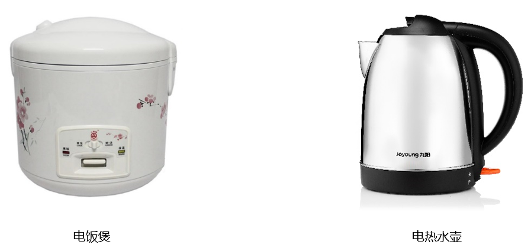

# i3自鎖開關

## 實體照片

## 基本資料

中文名稱：自鎖開關

英文名稱：Self Locking Switch

序号：i3

SKU：BOS0003

## 功能簡介

自鎖開關是一種常見的按鈕開關。與按鈕模組不同的地方在於它可以把開關鎖定在某個狀態。直到第二次被按以後彈起。這種巧妙的技術廣泛應用於我们的家用電器中，比如電鍋、電熱水壺等。

## 使用說明

自锁开关能够识别按键动作並輸出數位訊號。其机制如下：

> * 第一次按键，按键按下，开关接通并保持，模块持续输出高电平，即“开”或“1”；
> * 第二次按键，按键弹起，开关断开，模块输出低电平，即“关”或“0”。

以自锁开关控制LED灯为例，第一次按下按键，持续输出高电平，小灯常亮；第二次按下按键，按键被弹起，输出低电平，小灯熄灭。

## 原理介绍

無

## 應用範例

### \(1\) 點亮LED燈（非编程）

**範例說明：**通过自锁开关控制LED的亮灭。第一次按下自锁开关，LED灯被点亮，第二次按下自锁开关，LED灯被熄灭。

**元件清單：**自锁开关；LED模块；电源主板-单路。

**連線圖：**

### \(2\) 點亮LED燈（编程）

**範例說明：**通过自锁开关控制LED的亮灭。第一次按下自锁开关，LED灯被点亮，第二次按下自锁开关，LED灯被熄灭。

**元件清單：**自锁开关；LED模块；Micro:bit；Micro:bit BOSON扩展板。

**連線圖：**将自锁开关连接至Micro:bit扩展板引脚P0，LED模块连接至Micro:bit扩展板引脚P8。

**執行流程：**① 如果引脚P0输出高电平（“1”），即自锁开关被按下，则LED模块亮起；② 如果引脚P0输出低电平（“0”），即自锁开关被松开，则LED模块熄灭。

**程式示意圖（中文版）：**

**Sample program:**

### \(3\) 開啟風扇

**範例說明：**通过自锁开关控制风扇的开启与关闭。第一次按下自锁开关，风扇开始转动，第二次按下自锁开关，风扇停止转动。

**元件清單：**自锁开关；风扇模块；电源主板-单路。

**連線圖：**

### \(4\) 爬爬蟲

**範例說明：**通过自锁开关和舵机控制模块控制舵机像虫子一样向前爬动。

**元件清單：**自锁开关；舵机控制模块；9g金属舵机模块；电源主板-单路。

**連線圖：**

## 參數規格

引脚說明：

重量： （g）

尺寸：26mm\*22mm

工作電壓：3.0-5.5V

工作電流：不大于5mA@5V

