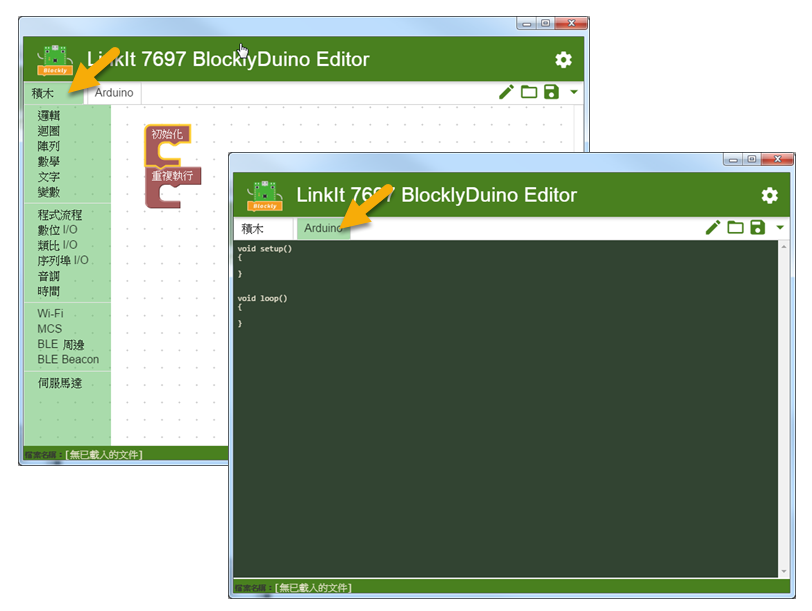
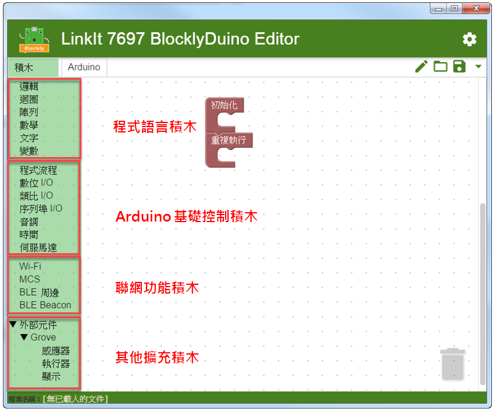
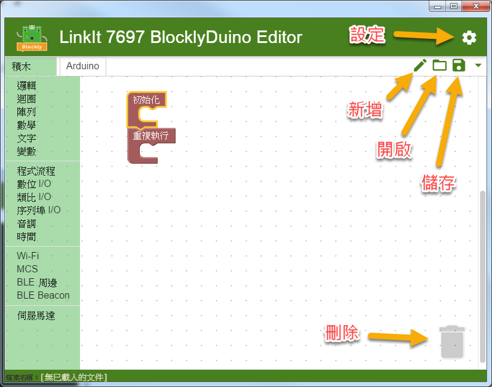
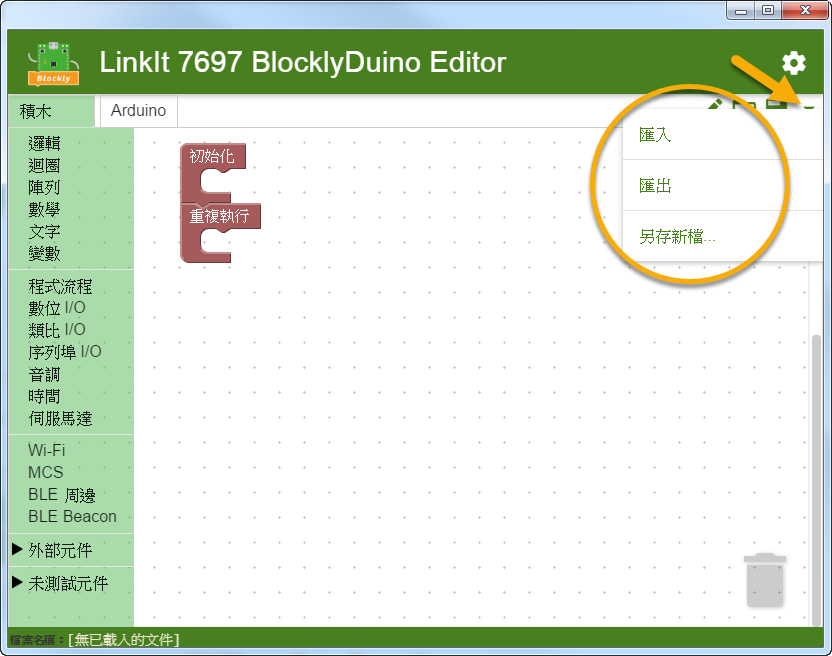
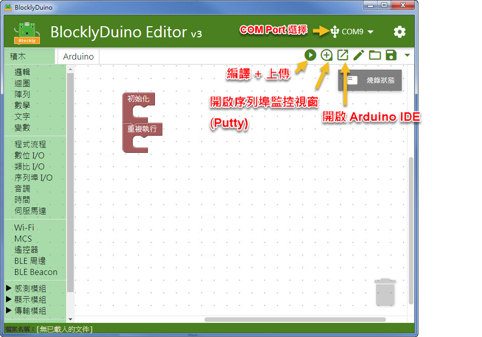
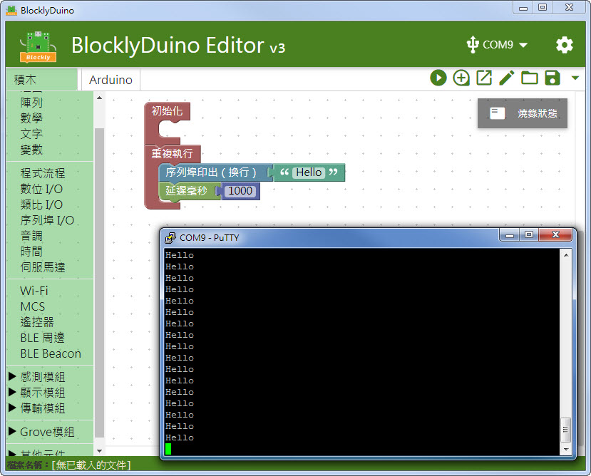

# BlocklyDuino 基礎操作

### 積木畫布 + Arduino 程式 

**BlocklyDuino** 編輯器當中有兩個頁面，分別是「**積木**」和「**Arduino**」。

* 在**積木頁面，**可以拖拉積木的方式產生對應的程式邏輯。BlocklyDuino 編輯器會自動產生出對應的 Arduino 程式，並顯示在 Arduino 頁面當中
* 在 **Arduino 頁面**中的程式碼只是"**純顯示"**， 讓開發者了解怎樣的積木產生了怎樣的 code， 無法在這頁面內修改程式

### 積木類型 

目前 BlocklyDuino 編輯器支持四種積木類型

* **程式語言積木**: 包含最基礎的程式邏輯和資料型態 (Data type) 的處理
* **Arduino 基礎控制積木** : 包含 Arduino 的核心操作功能， 透過這些積木可以和 LinkIt 7697 開發板的硬體及部分周邊做溝通
* **聯網功能積木** : 連接 Wi-Fi, 藍芽 (BLE)，以及連接 MCS/MCSLite 做雲端資收集和控制
* **其他擴充積木** : 提供各類型周邊的控制積木， 會隨時間陸續增加更多周邊的支持

### 基礎程式流程 

最原始的畫布上， 會有 "初始化" 和"重複執行" 兩個積木， 對應到 Arduino 就是 setup() 和 loop()  這兩個函式

* **初始化** : 擺放於此的積木在開機後只會被執行 "**一次"**
* **重複執行** : 擺放於此的積木會被一直 "**重複"** 的執行


若不小心移除掉 "初始化" 或"重複執行" 的積木， 可以到 "**積木 > 程式流程**" 內再拉出來。



若將積木擺放到這兩個流程方塊之外， 編輯器可能會無法產生出正確的 Arduino 程式。


### 積木基礎操作 

以下介紹幾個編輯積木常用的操作: 

* **新增功能積木** : 從左邊**積木區**的拖拉出來到**畫布。**程式邏輯會照依照積木的順序，**從上往下**執行
* **新增參數積木** : 接上**參數**或**變數**，有些積木若型別不對會接不上去
* **刪除積木** : 將積木拖拉到左邊的積木區，或是拖拉到垃圾桶上
* **可變動積木** : 有些積木上有個**星星**，點選可以更改這積木的功能
* **複製積木** : 在積木上按滑鼠右鍵叫出選單，選擇 **複製積木**
* **暫存積木**: 畫布上的**所有積木**都會**自動產生 Arduino 的程式**，有兩種方式可以將暫時沒用的積木留在畫布上但不要產生對應的 Arduino 程式碼。把積木拖拉到 **暫存區 **積木內 (可在**程式流程**內找到此積木)，或是在積木上按滑鼠右鍵叫出選單，選擇 **停用積木**\

* **匯入** : 匯入一個 積木的 xml 描述內容 (畫布上的方塊都是用 xml 來描述的)，新增積木到畫布上
* **匯出** : 匯出此畫布的積木成一個 xml 描述內容
* **另存新檔 **:** **將畫布上的內容另外儲存成另一個專案


BlocklyDuino 的一個**專案**會是以 **"資料夾"** 的形式存在, 裡面包含一個 **.xml** 檔案 (描述畫布上的積木) 和** .ino** 檔案 (Arduino 的程式)

在 BlocklyDuino 內**開啟**或**儲存**, 都是選擇 "**資料夾"**

概念上, 在畫布拖拉積木的改變都是會存在** .xml** 檔案 (畫布描述檔), 然後編輯器會"自動"產生對應的 **.ino **(Arduino 程式檔)

後續若要脫離圖像化編輯開發環境, 要將這 ino 複製一份編輯比較安全, 不然在 BlocklyDuino 編輯器內拖拉積木在儲存, .ino 又會被改持畫布上對應的程式內容，



BlocklyDuino v3 版本整合入編譯和序列埠監控等功能


此為 LinkIt 7697 BlocklyDuino v3 新功能, 預計於七月初發佈


* **Com Port 選擇** :  若有正確安裝 CP2102 驅動並連接上 LinkIt 7697，應可看到新增的 Com Port
* **編譯 + 上傳** : 可直接於 BlocklDuino 編譯和上傳，編譯和上傳狀態可以點開 "燒錄狀態" 看詳細的 Log 
* **開啟序列埠監控視窗 **:** **開啟 Putty 來接收透過 UART 傳出的訊息，預設速度為 9600
* **開啟 Arduino IDE** : 開啟 Arduino IDE (包含在此包 BlocklyDuino 內的)，開啟前此檔案需先儲存過

開啟 Putty 畫面如下，若需要修改 baud rate，可點選視窗左上的 Putty 按鈕 -> Change Setting，在 Connection -> Serial 中修改

### FAQ 

**Q: 為何有時積木接上去時會彈開?A: **若資料型態不正確時，可能會接不上去，現象就是方塊會彈開。如下圖的範例，要將一個**整數**接到**字串**上是接不上去的。 目前的 BlocklyDuino 對於型別檢查的實作還不夠嚴謹，有時會發生型別不對但接得上去，產生出來的 Arduino 程式就會編譯錯誤，之後會持續優化這一塊型別檢查的機制。
