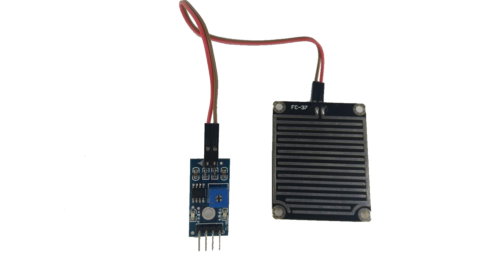

# 科易KEYES 雨水感測器



### **專案說明**

**使用「LinkIt 7697 NANO Breakout」連接「科易KEYES 雨水感測器」,讀取科易KEYES 雨水感測器模組數值變化。**

**此科易KEYES 雨水感測器模組包含於「**[**科易KEYES 雨水感測器**](https://robotkingdom.com.tw/product/keyes-%e9%9b%a8%e6%b0%b4%e6%84%9f%e6%b8%ac%e5%99%a8/)**」內。**

### **LinkIt 7697 電路圖**

* [**LinkIt 7697**](https://www.robotkingdom.com.tw/product/linkit-7697/)
* **LinkIt 7697 NANO Breakout**
* **科易KEYES 雨水感測器模組**

科易KEYES 雨水感測器模組是類比/數位訊號輸入，可以接「D0 ~ D13、A0~A3」的 LinkIt 7697 NANO Breakout訊號端上。 本範例類比\(AO\)連接至「A0」、數位\(DO\)連接至「D5」。



**感測模組特點：**

**可以檢測有無雨水跟水量的多寡。**

**雨滴感應板跟控制板接線無正負之分，可隨意連接。**

**可調整偵測水滴的靈敏度（圖中藍色電位器調節）**

**工作電壓 3.3V-5V**

**輸出形式 ：DO數位開關信號輸出（0和1）和AO類比電壓輸出**

**模組使用注意事項：**

**VCC:接電源正端（3-5V）、GND:接電源接地、DO:數位開關信號輸出、AO:類比電壓輸出**

**當接上電源時，電源提示燈亮，感應板上沒有水滴時， DO輸出為高電位，開關提示燈滅，滴上一滴水，DO輸出為低電位，開關提示燈亮，清除掉上面的水滴，又恢復到輸出高電平狀態。AO輸出可檢測滴在上面的雨量大小及是否有雨，當沒有水滴時數值為1023，當有水滴時水滴多寡會跟數值成反比，水量越多數值越小。**

**因為7697ADC 的輸入電壓上限為 2.5V，此模組為5V輸入，所以如需更精準地測量，需要連接分壓電路使用，使用**[**KEYES Arduino UNO R3**](https://www.robotkingdom.com.tw/product/keyes-uno-r3/)**等其他Arduino則無此問題。**

**分壓電路請參考以下MediaTek Labs網站**

[**https://docs.labs.mediatek.com/resource/linkit7697-arduino/zh\_tw/developer-guide/adc**](https://docs.labs.mediatek.com/resource/linkit7697-arduino/zh_tw/developer-guide/adc)


### **BlocklyDuino 積木畫布**

**每1秒鐘會讀取雨水感測器模組的數值一次， 並顯示在序列埠監控視窗上。數位訊號輸入的值0代表偵測到水滴、1代表偵測沒偵測到水滴。由於7697 ADC 的解析度為 12-bit，此雨水感測器為10-bit所以需要經過映射處理成10-bit。類比輸入訊號的值代表偵測雨水的類比值，數值越小代表感測器偵測到的水量越多，數值1023代表沒有水滴。1秒鐘顯示一次雨水偵測狀態以及雨水的類比數值。**


### **Arduino 程式**

```text
int RAIND;
int RAINA;
void setup()
{
  pinMode(5, INPUT);
  Serial.begin(9600);
}
void loop()
{
  RAIND = digitalRead(5);
  RAINA = (map(analogRead(A0),0,4095,0,1023));
  Serial.println(digitalRead(5));
  if (RAIND == 1) {
    Serial.println("沒有下雨");
  } else if (RAIND == 0) {
    Serial.println("偵測到雨水");
  }
  Serial.println("雨水的數值:");
  Serial.println(RAINA);
  delay(1000);
}
```

