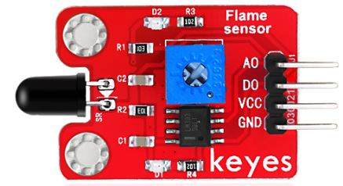

# 火焰感測器



## **科易KEYES 火焰感測器**

### **專案說明**

**使用「科易KEYES Arduino UNO R3 開發板」連接「科易KEYES 火焰感測器」,讀取科易KEYES 火焰感測器模組數值變化。**

**此科易KEYES 火焰感測器模組包含於「**[**科易KEYES 火焰感測器**](https://www.robotkingdom.com.tw/product/keyes-flamesensor/)**」內。**

### **KEYES Arduino UNO R3電路圖**

**·**       [ **KEYES Arduino UNO R3**](https://www.robotkingdom.com.tw/product/keyes-uno-r3/)

**·        通用型彩色Sensor shield v5.0感測器擴充板**

**·        科易KEYES 火焰感測器模組**

**科易KEYES 火焰感測器模組是類比/數位訊號輸入，可以接「A0 ~ A5」/「D0 ~ D13」的KEYES Arduino UNO R3訊號端上。 本範例連接到「A0」/「D3」**


**感測模組特點：**

**可以檢測火焰或者波長在 760 nm\(奈米, 10的負9次方\) ~1100 nm範圍內的光源，建議當火焰越大時，測試距離越遠**

**可調整靈敏度（圖中藍色電位器調節）**

**工作電壓 3.3V-5V**

**輸出形式 ：DO數位開關量輸出（0和1）和AO類比電壓輸出**

**模組使用注意事項：**

**火焰感測器對火焰最敏感，對普通光也是有反應的，一般用做火焰報警等用途。**

**感測器與火焰要保持一定距離，以免高溫損壞感測器，當火焰越大，測試距離越遠。**

### **Arduino 程式**

**每1秒鐘會讀取火焰感測器模組的數值一次， 並顯示在序列埠監控視窗上。類比輸入訊號的值代表偵測火焰的類比值，數值越小代表感測器偵測到的火焰越強，數值越大代表沒有火焰。數位訊號輸入的值0代表偵測到火焰1代表偵測沒偵測到火焰。程式設計成當偵測到火焰時開啟LED燈，沒偵測到火焰時LED關閉，並且1秒鐘顯示一次火焰偵測狀態以及火焰類比數值。**


**產生出的 Arduino 程式如下**

```text
int led = 13; // 定義LED的腳位
int digitalPin = 3; // 定義KY-026 數位腳位
int analogPin = A0; // 定義KY-026 類比腳位
int digitalVal; // 定義數位讀取值
int analogVal; //  定義類比讀取值
void setup()
{
  pinMode(led, OUTPUT);
  pinMode(digitalPin, INPUT);
  Serial.begin(9600);
}
void loop()
{
  // 讀取火焰數位數值
  digitalVal = digitalRead(digitalPin); 
  if(digitalVal == HIGH) // 如果沒有偵測到火焰
  {
    digitalWrite(led, LOW); // 關閉 LED
    Serial.println("沒有偵測到火焰");
  }
  else                      // 如果偵測到火焰
  {
    digitalWrite(led, HIGH); // 開啟 LED
    Serial.println("偵測到火焰");
    Serial.println("LED 開啟");
    Serial.println("** 請關閉火焰 **");
  }
  // 讀取火焰類比數值
  analogVal = analogRead(analogPin); 
  Serial.println("火焰類比數值:");
  Serial.println(analogVal); // print analog value to serial
  delay(1000);
}
```

