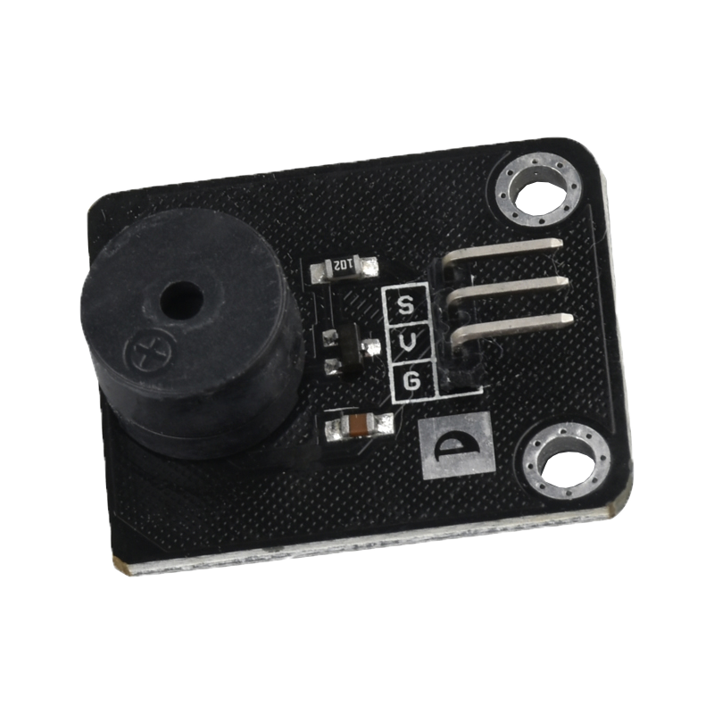
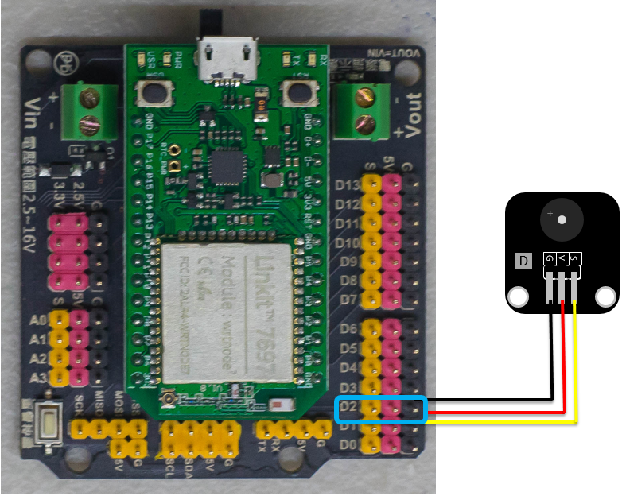

# 無源蜂鳴器模組



## LinkIt 7697 專案說明

使用「LinkIt 7697 NANO Breakout」連接「無源蜂鳴器模組」， 每一秒控制無源蜂鳴器模組發出「Do」的音階和靜音 。

此**無源蜂鳴器模組**包含於「[**洞洞么教學材料包**](https://www.robotkingdom.com.tw/product/rk-education-kit-001/) 」內 。

### LinkIt 7697 電路圖

* [LinkIt 7697](https://www.robotkingdom.com.tw/product/linkit-7697/)
* LinkIt 7697 NANO Breakout
* 無源蜂鳴器模組

**無源蜂鳴器模組**是**脈衝寬度調變\(Pulse Width Modulation\)訊號**輸出， 可以接「D0 ~ D13」的 LinkIt 7697 NANO Breakout訊號端上。 本範例連接到「**D2**」。


蜂鳴器分為「有源蜂鳴器」及「無源蜂鳴器」，「有源蜂鳴器」僅能發出單一頻率的聲音；「無源蜂鳴器」可依據不同的頻率發出不同聲調的聲音。




### BlocklyDuino 積木畫布

每一秒控制無源蜂鳴器模組發出「Do」的音階和靜音。


### Arduino 程式

```c
void setup()
{

}


void loop()
{
  tone(2, 262);
  delay(1000);
  noTone(2);
  delay(1000);
}
```

## micro:bit 專案說明

使用「micro:bit搭配科易KEYES micro:bit 感測器擴充板 V2」連接「無源蜂鳴器模組」，每一秒控制無源蜂鳴器模組發出「Do、Re、Mi、Do」的音階和靜音 。

此**無源蜂鳴器模組**包含於「[**洞洞么教學材料包**](https://www.robotkingdom.com.tw/product/rk-education-kit-001/) 」內。

### micro:bit電路圖

* [BBC micro:bit 微控制板
  ](https://www.robotkingdom.com.tw/product/bbc-microbit-1/)
* [科易KEYES micro:bit 感測器擴充板 V2
  ](https://www.robotkingdom.com.tw/product/keyes-microbit-sensor-breakout-v2/)
* 無源蜂鳴器模組

**無源蜂鳴器模組**是**脈衝寬度調變\(Pulse Width Modulation\)訊號**輸出， 可以接「P0」的 micro:bit訊號端上。 本範例連接到「P0」。


鳴器分為「有源蜂鳴器」及「無源蜂鳴器」，「有源蜂鳴器」僅能發出單一頻率的聲音；「無源蜂鳴器」可依據不同的頻率發出不同聲調的聲音。



### Microsoft MakeCode積木畫布

每一秒控制無源蜂鳴器模組發出「Do、Re、Mi、Do」的音階和靜音 。


### JavaScript 程式

```javascript
basic.forever(function () {
    music.playTone(262, music.beat(BeatFraction.Whole))
    basic.pause(1000)
    music.playTone(294, music.beat(BeatFraction.Whole))
    basic.pause(1000)
    music.playTone(330, music.beat(BeatFraction.Whole))
    basic.pause(1000)
    music.playTone(262, music.beat(BeatFraction.Whole))
})

```

