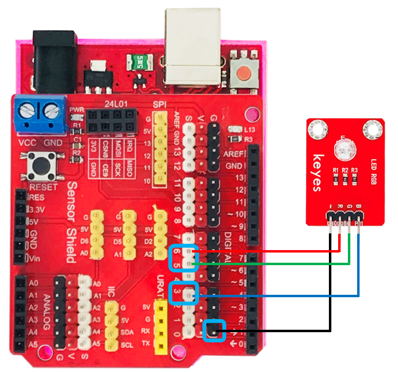

# RGB LED共陰模組


## 專案說明

使用「科易KEYES Arduino UNO R3 開發板」連接「RGB LED共陰模組」, 每1秒鐘改變LED顏色一次。

此**RGB LED共陰模組**包含於「[洞洞兩教學材料包 Education Kit 002](https://www.robotkingdom.com.tw/product/rk-education-kit-002/)」內。

## 電路圖

* [KEYES Arduino UNO R3 ](https://www.robotkingdom.com.tw/product/keyes-uno-r3/)
* 通用型彩色Sensor shield v5.0感測器擴充板
* RGB LED共陰模組

**RGB LED共陰模組**是數位/PWM訊號輸出， 可以接「D0 ~ D13/D3、D5、D6、D9、D10」的 KEYES Arduino UNO R3訊號端上。使用數位輸出時可以顯示RGB三種顏色的燈，使用PWM訊號輸出時可以依據PWM的數值顯示各種不同顏色的燈。 本範例連接到「**D3**、**D5**、**D6**」



## Arduino 程式

將3號、5號、6號腳位的PWM訊號依序輸出，RGB LED模組會陸續顯示紅色1S，綠色1S，藍色1S，黃色1S，紫色1S，白色1S，停止顯示1S，然後循環交替。RGB LED模組是用PWM訊號輸出函式所代表的顏色分別為color\(紅色, 綠色, 藍色\)數值為0到255，color\(255, 0, 0\)代表紅色亮、color\(0, 255, 0\)代表綠色亮、color\(0, 0, 255\)代表藍色亮、color\(255,255,0\) 代表黃色亮、color\(128,0,255\)代表紫色亮、color\(255,255,255\)代表白色亮，可以根據需要亮的顏色去調整數值。

產生出的 Arduino 程式如下

```c
int redPin = 6;  // R 紅色LED 控制引腳 連接到Arduino的5腳 
int greenPin = 5  // G綠色LED 控制引腳 連接到Arduino的4腳
int bluePin = 3;  // B藍色LED 控制引腳 連接到Arduino的3腳    
void setup()    
{   
        pinMode(redPin, OUTPUT); //設置redPin對應的腳位5為輸出
        pinMode(greenPin, OUTPUT); //設置greenPin,對應的腳位4為輸出
        pinMode(bluePin, OUTPUT); //設置bluePin對應的腳位3為輸出
}    

void loop()  // run over and over again  
{    
        // Basic colors:  
       color(255, 0, 0); // 紅色亮
       delay(1000); // 延遲一秒 
       color(0,255, 0); //綠色亮
       delay(1000); //延遲一秒
       color(0, 0, 255); // 藍色燈亮  
       delay(1000); //延遲一秒

        // Example blended colors:  
        color(255,255,0); // 黃色亮  
        delay(1000); //延遲一秒      
        color(128,0,255); // 紫色亮  
        delay(1000); //延遲一秒
        color(255,255,255); // 白色亮
        delay(1000); //延遲一秒
        color(0,0,0); // 關閉led  
        delay(1000); //延遲一秒  
}          
void color (unsigned char red, unsigned char green, unsigned char blue)  //顏色控制函數 
{    
        analogWrite(redPin, red);   
        analogWrite(greenPin,green); 
        analogWrite(bluePin, blue); 
} 

```


